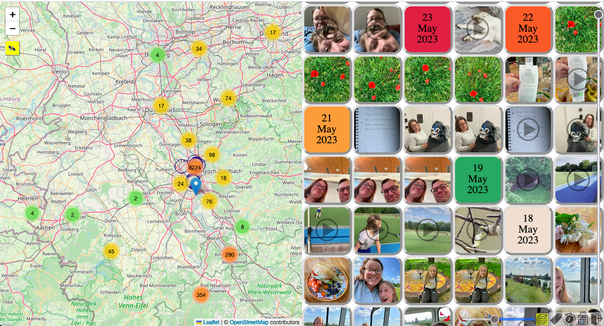
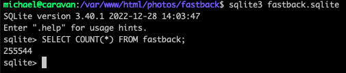
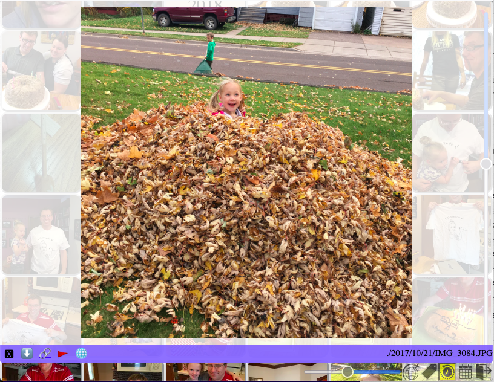
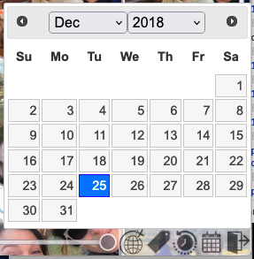
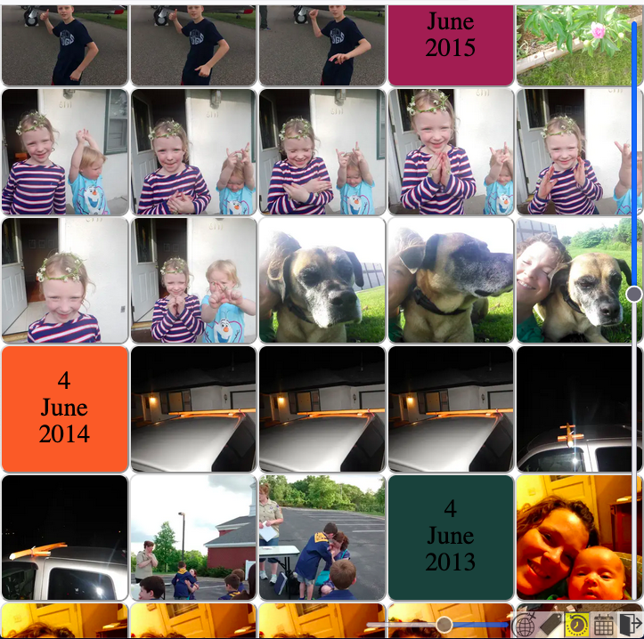
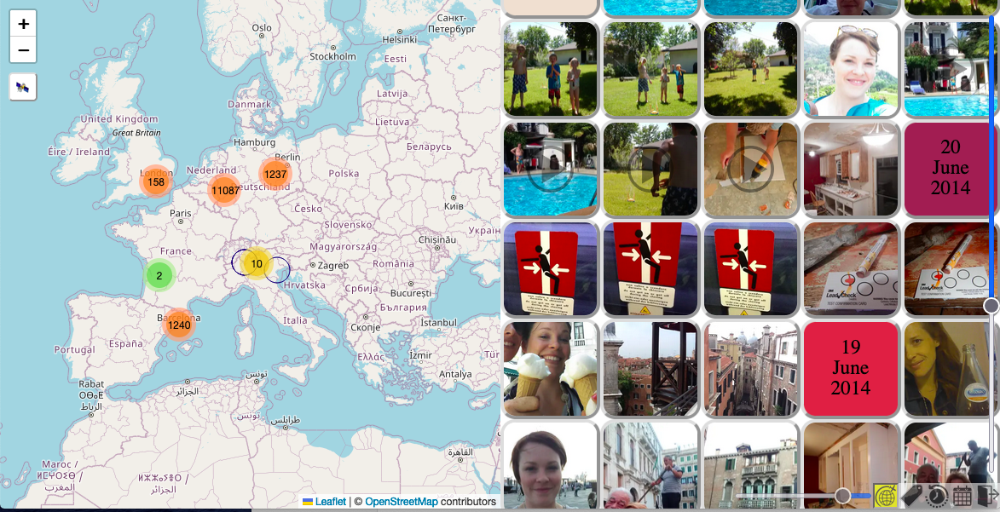
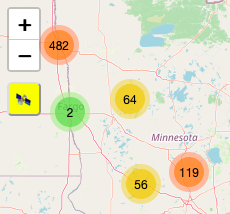
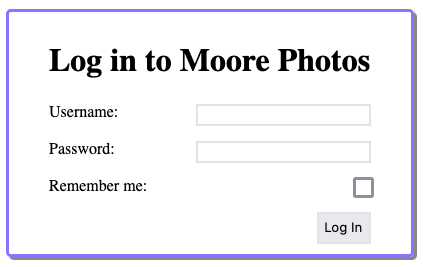
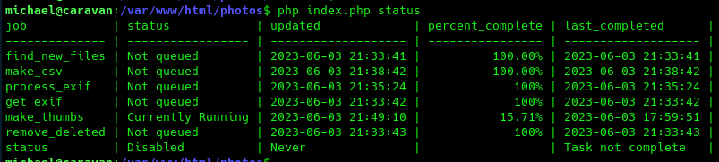
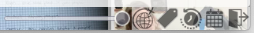

Fastback
========
Fastback is a tool for navigating a large home collection of photos and videos.
I am using it with over 250,000 photos and videos and it performs well. 



Features 
-------------

### Support for large photo collections



Easily navigate hundreds of thousands of photos. The performance on my home
server with 250,000 photos is quite acceptable. Especially once the thumbnails
are generated and the exif data has been processed the site works quite smothly. 

### View fullsized images, play videos 



Clicking on a thumbnail will open the large view. Images that are not browser
compatible are automatically converted to jpg. Videos that are web compatible
show up in a video player. Other videos are represented with a static thumbnail,
and the user would need to download them and play them with some other
video player. 

The icons in the purple toolbar at the bottom are: Close, Download Original,
Copy Sharable Link, Flag Photo, View On Map.

### Navigate photos by dates


Fastback includes a date picker so you can jump directly to the photos nearest
to the date you choose. The date range is automatically set to the date range of
your photos. 

### Fleeting moments, precious memories



The Rewind tool filters photos to only show those which were taken on
today's date in previous years. 

The Date Picker tool works together with the Rewind tool too. If Rewind is
active and you select a date, you will see all photos taken on that date in
previous years instead of on today's date.

### Map view


If GPS coordinates are detected in your photos then the map tool will be
enabled. You can then toggle the map view open and closed. The map shows all
photos available with the current filters. By default then, it will show all
photos with GPS info. If you activate the Rewind tool, then all photos from
today's date in previous years will show on the map. 

Photos currently in the scrolling viewing area are shown as a blue circle
outline on the map. Hovering over photos in the viewing area will make the blue
circle outline flash. 

Hovering over the markers on the map will make the photos in the viewing area
flash. 

Clicking on a marker cluster will Zoom in on the map to expand the cluster. If
you are zoomed all the way in, the markers in that loation will "spider" so you
can click individual markers. Clicking an individual marker will pop open the
large size of that image. 

The map uses Leaflet with free basemaps from Open Street Maps. Please respect
[OSM's basemap tile usage policy](https://operations.osmfoundation.org/policies/tiles/). 
`index.php` includes instructions and a sample of how to change to another
basemap provider.  Please do so if you are using anything beyond incidental
small home usage. 

#### Map view filter



The map can also be used as a filter. The icon on the map will toggle filtering
by map view. Only photos which have GPS coordinates on the current map view will
be show in the viewing area. 

This filter combines with the all other filters. For example, if Rewind is
active and the Map view filter is active, and the map is zoomed to show
Minnesota, then only photos from today's date in previous years, in Minnesota
will appear in the list and on the map.

### Filter by tags


If your photos have tags, you can filter by them. This is only tested wtih the
face tags generated by Digikam. The filter can be set to either ANY or ALL. An
ALL filter means only photos which have all active tags will be shown. ANY means
any photos which match at least one tag will be shown.

This filter also works together with all other filters.

### User accounts



You can add user accounts in `index.php` for privacy. The web admin must put a
username and password in manually, and there is no password reset functionality. 

### Sharing and caring


The **copy-link** button creates a link that lets a user download a file, even
without logging in. 

### Command line tools



Several maintenance tasks may be run from the command line, for additional
control. `php index.php status` will show all tasks and their status. The
necessary tasks are run periodically via a web requests, but you may wish to run
the `make_thumbs` task from the command line multiple times to force processing
on multiple cores, for example. 

You can also run any task with debug enabled, like so: `php index.php debug
make_thumbs` 

This will print additional information to your console. 

### Other tools and interactions



The tools shown are: A slider which changes size of the thumbnails, Map toggle
button, Tag window toggle button, Rewind toggle button, Date picker button, log
out button. 

Not pictured is a vertical scrollbar that lets you quickly scroll through your
photos. 

Clicking on an individual thumbnail will open the fullsized-image. 

To move between full-sized images you can click on the right or left edges of
the full-sized photo. You can also swipe left or right, or use the arrow keys.

To close the full-sized image there is a close button you can click, but you can
also swipe up or press escape.

### Flagging a photo

If at least one user has been added, and if the user name is in the
`$fb->canflag[]` list, that user will have a little red flag available on every
full-sized image screen. 

Clicking the flag will mark the file as **flagged** in the database. Flagged
photos will not be included the next time the CSV file is generated. The file is
not deleted or anything, but technical users could use the status in the
database to perform other actions. 

In our case, our phone photo collections end up with a lot of screenshots or
pictures of receitps. Flagging photos makes it so we don't have to look at them,
and we can delete them later.

### Auto detecting memes

Fastback tries to detect memes and other low quality type images based on its
metadata. If you aren't seeing images you expect to, you can try lowering the
threashold for exclusion. Eg. `$fb->maybe_meme_level = -10`.

The heuristics are quite basic right now. It checks for small image size, lack
of metadata, file type, presence of coordinates, etc.

Since we are dealing with hundreds of thousands of photos, missing a few isn't a
big deal for us at the moment and the experience when using the site is
improved. 

### Other features

 * Tested on iOS and Android
 * Convert non-web-friendly image formats on the fly (eg. HEIC)
 * Easy to set up (for a web app)
 * Reads exif data from xmp sidecar files (if named correnctly, eg. IMG_123.JPG could have sidecar IMG_123.JPG.xmp)

Requirements
-------------

 * Linux PHP server
 * Sqlite3 support
 * find (command line tool)
 * Writable cache directory

Strongly Recommended
--------------------

 * PHP-CLI
 * exiftool (required for geo, tagging and date sorting support)
 * ffmpeg (required for video thumbnails)
 * vipsthumbnail (for best image thumbnails)
     - As a backup Fastback will try to use convert (ImageMagick, command line program) or 
     GD (PHP library)
 * jpegoptim (optional, for smaller thumbs)
 * gzip (optional, for smaller csv over the wire)
 * htaccess support (for more security of your cache files)

Installation and Setup
----------------------
 * Clone this repository into a directory on your web server.
```
cd /var/www/html/photos/
git clone https://github.com/stuporglue/fastback.git
```

 * Copy `fastback/index.php` up a level into `/var/www/html/photos`
```
cp fastabck/index.php .
```

 * If your photo directories are NOT in `/var/www/html/photos` then edit
 `index.php`. Set `$fb->photobase` to the path to your files. If your photos are 
 in the same directory as `index.php` you can skip this step.
 ```
 $fb->photobase = '/mount/bigdisk/photo_album/';
 ```

 * Visit your site at `https://yoursite.com/photos/`


First Run
---------

The first visit will attempt to create the cache directory and find all photos
and videos.  It will also try to create an sqlite database file and CSV file of
the photo info at `cache/fastback.csv`. 

If any of these can't be created, Fastback should log the error display a
message on web page.

If they are created you should see your photos right away. 

As you use the site a background worker will run some tasks to extract metadata
(photo creation time, coordinates, tags). As this data is processed the site
will become more and more useful. 


Configuration & Settings
------------------------

Basic configuration options are shown with sample values in `index.php`, but
commented out.

For a list of all available options see `fastback.php`. They are pretty well
documented. Some options you might want to set include: 

```
$fb = new Fastback();
// Change the site title
$fb->sitetitle = "Moore Family Gallery";

// Specify where full sized photos are located. This can read-only. 
$fb->photobase = '/mount/bigdisk/my_photos/'; 

// Specify where the sqlite file is located. The file itself must be read-write.
$fb->sqlitefile = '/mount/fastdisk/fastback_gallery.sqlite';

// Specify the cache directory. This needs to be writable by the web server.
$fb->filecache= '/mount/fastdisk/cachedir';

// Specify where the csv file is saved. The location must be read-write. 
// Defaults the cache directory
$fb->csvfile = '/mount/fastdisk/fastback_cache.csv';

// Add a user account
$fb->user['Michael'] = 'moore';

// Give the user permission to flag photos
$fb->canflag[] = 'Michael';

// Regex used to find photo directories
$fb->photodirregex = './[0-9]\{4\}/[0-9]\{2\}/[0-9]\{2\}/'; 

// Add support for tiff files
$fb->supported_photo_types[] = 'tiff';

// Change to a different basemap
$fb->basemap =  "L.tileLayer('https://server.arcgisonline.com/ArcGIS/rest/services/World_Imagery/MapServer/tile/{z}/{y}/{x}', {
	attribution: 'Tiles &copy; Esri &mdash; Source: Esri, i-cubed, USDA, USGS, AEX, GeoEye, Getmapping, Aerogrid, IGN, IGP, UPR-EGP, and the GIS User Community'
})";

$fb->run();
```

If you wish to speed up your site, you could use .htaccess to directly serve requests
for thumbnails, full-sized files and the csv file through your web server instead of through
fastback.php. 

Upsides: 
 * Much faster

Downsides:
 * Fastback checks if a user is logged in before serving a file. Using .htacess
 skips this check. 
 * You will need to make sure that your full-sized photos and thumbnail
 directories are both available online.

To use the .htaccess method, copy the `direct_file_access.htaccess` file up a
level, edit the paths and URLs, and rename it to `.htaccess`.

Usage
-----

### Basics

Once it is installed you should be able to just use the site. A task runner gets
kicked off by ajax 30 seconds after every page load and runs every 5 minutes
while the page is open. 

The cron job finds new files, loads metadata from the files exif info and
detects deleted photos. Cron jobs run for up to 120 seconds at a time and on up
to 1/4 of the cores on your server.

The first page load may take a minutes or two to load as a list of files is
found. 

### Behind the scenes

Extracting exif data is a very slow process since every file must be read. Until
exif data has been read photos will sort based on the file modification time
instead of the time stored in the files metadata. The same is true for tag
filtering and geolocation. 

Thumbnails are generated on first access.

### Running cron on the command line
If you want to handle these processes more quickly, you can run `php index.php`
on the command line. This will run without timing out.

The make_thumbs cronjob is disabled by default. You can enable it in index.php 
(`$fb->cronjob[] = 'make_thumbs';`) and build all thumbs at the cost of disk space.

### Debugging
Set `$fb->debug = true;` and quite verbose logging will be sent to
`$fb->filecache/fastback.log`. 


Troubleshooting
---------------
* My photos are out of order
    - Photos are temporarily sorted by their file modification time. Reading the
    exif data is a slow process. You can see the status of these tasks by
    visiting `https://yoursite.com/photos/cron=status`.

* The map feature and tag features aren't showing up on my website
    - These features are enabled automatically once coordinates (for the map) or
    tags (for the tags!) are found.  If you have a photo that you think has such
    metadata but it isn't reflected on the site, please send me the photo so I
    can see how the exif data is structured. I have 200,000+ photos but I'm sure
    there are other exif formats that Fasback doesn't handle correctly yet. 

* The site freezes up without any thumbnails
    - By default thumbnails are generated and saved on-demand. This saves on
    disk space at the cost of performance.  You can pre-generate all the
    thumbnails by enabling the make_thumbs cron job in your index.php file. 
    ```
    $fb->cronjobs[] = 'make_thumbs';
    ```
    You can also run the job manually from the command line. Running from the
    command line won't time out like the browser-based cron tasks do. You can
    run it like so: 
    ```
    >$ php index.php make_thumbs
    ```
    You can also pre-generate the thumbnails through any other method you want.
    The default size is 256x256, but any image will work. The thumbnails should
    put in the cache directory with the same path and name as the original, but
    in .webp format with .webp appended to the end. So if my original was
    `/path/to/photos/2023/01/01/new_years.jpg` the thumbnail would be
    `/path/to/cache/2023/01/01/new_years.jpg.webp`.

* Some thumbnails can be created and some cannot. What's going on? 
    - If you use the command line to run `php index.php make_thumbs` the files
    and folders will be created with the permissions of the user you are logged
    in as. The thumbs created via the web site will be crated with the
    permissions of the web server user. Try changing the permissions of the
    cache folder after making thumbs on the command line. If your webserver runs
    as user `www-data`, something like this might work:
    ```
    chown -R www-data /path/to/cachedir
    chmod -R 750 /path/to/cachedir
    ```
* The photos on my page are smaller at page load than I want
    - Your browser (and all browsers) have a max element height. Fastback uses
    hyperlist.js which uses this max height and the number of photos to
    determine the max width of the thumbnails. 

* Videos don't play
    - Browser can only play a few media formats. Fastback will generated 
    streamable videos, but this process is quite slow. You can run it from the
    command line to use more cores and to create the streamable copies faster.
    `php index.php make_streamable`.

* The make_streamable or make_thumbs cron job never reaches 100% completion
    - Some videos or images may be corrupt or have other issues which prevent a streamable
    version or thumbnail from being made. You can reset these by running 
    `UPDATE fastback SET streamable_made=NULL WHERE streamable_made=0;` (for videos)
    or in the
    database.

License, Credits and Thanks
----------------------------
This project is under the [LICENSE.txt](MIT License). 

It uses code from many other projects under various Open Source licenses, including: 
 * [https://github.com/tbranyen/hyperlist](hyperlist)
 * [PapaParse](https://www.papaparse.com/)
 * jQuery ([https://jquery.com/](jQuery), [https://jqueryui.com/](jQuery-ui))
 * Leaflet ([https://leafletjs.com/](Leaflet.js), [https://github.com/Leaflet/Leaflet.markercluster](Leaflet MarkerCluster))
 * [https://hammerjs.github.io/](hammer.js)

Many thanks to the maintainers and developers of these projects for making this 
possible. I wouldn't have had the time or patience to make it all from scratch.


TODO
----
* Location search input 
* Don't collapse exif tags
* Make colors customizable
* Be able to zoom and pan on single image view
* Make animated thumbs for videos

Disclaimers and Design Decisions
--------------------------------

I'm making this for myself and my family. We have over 250,000 family photos
(1.7 TB). These are from almost 20 years of marriage, plus all the scanned
photos and slides that our parents took of us when we were kids. We mostly store
our photos in directories structured like YYYY/MM/DD. I organize all new photos
with them with a [python script](https://github.com/stuporglue/ImportMedia) I
wrote, or by importing them through [Digikam](https://www.digikam.org/).  I have
Digikam configured write changes to xmp sidecar files instead of back to the
original image. We use Digikam's face detection and tagging features quite a
lot. 

This project was creaed with a couple of core needs in mind. First, it had to
handle a lot of photos. Second, my wife loves the Facebook Memories feature,
looking at photos that were posted on today's date in past years. I also like
looking back at photos from trips we have taken, so I wanted some sort of map
search functionality. And we both wanted a way to look for photos of our kids
with their grandparents or aunts and uncles. So some face tagging support was
needed. Lastly, it had to be accessible from anywhere on our phones. 

Since I couldn't find anything that supported all of those features, I decided
to make my own site to host at home. 

Fastback is designed to be simple and for use by a small, trusted group.  It is
not meant for big groups or heavy usage. It is built to meet our family photo
needs. Hopefully it is also useful to you. 

Basic steps have been taken for security and performance, but it is not
specifically hardened or anything like that. Steps taken to enhance security and
performance include: 

 * (Performance) Caching file data in an sqlite database instead of reading it live
 * (Performance) Caching thumbnails and sending those instead of sending large files
 * (Performance) Creating a CSV file of data instead of JSON (Smaller file)
 * (Performance) gzipping CSV file to send less data
 * (Performance) Careful use of setTimeout in script to ensure that UI stays responsive
 * (Performance) Use of Progressive Web App technology to cache files locally
 * (Performance) Provided .htaccess file to use direct access for thumbs and fullsized, if you prefer.
 * (Security) Queries escape all user submitted data using SQLite3::escapeString
 * (Security) All application directories and cache directories have an empty `index.php` to prevent directory listings
 * (Security) .htaccess files prevent access to application, sqlite and cache files (if .htaccess support is enabled, of course)
 * (Security) All photo and thumbnail access is routed through Fastback so that permissions can be checked

Bug reports and feature requests are welcome. Clean, well documented, pull requests are even more welcome. 
